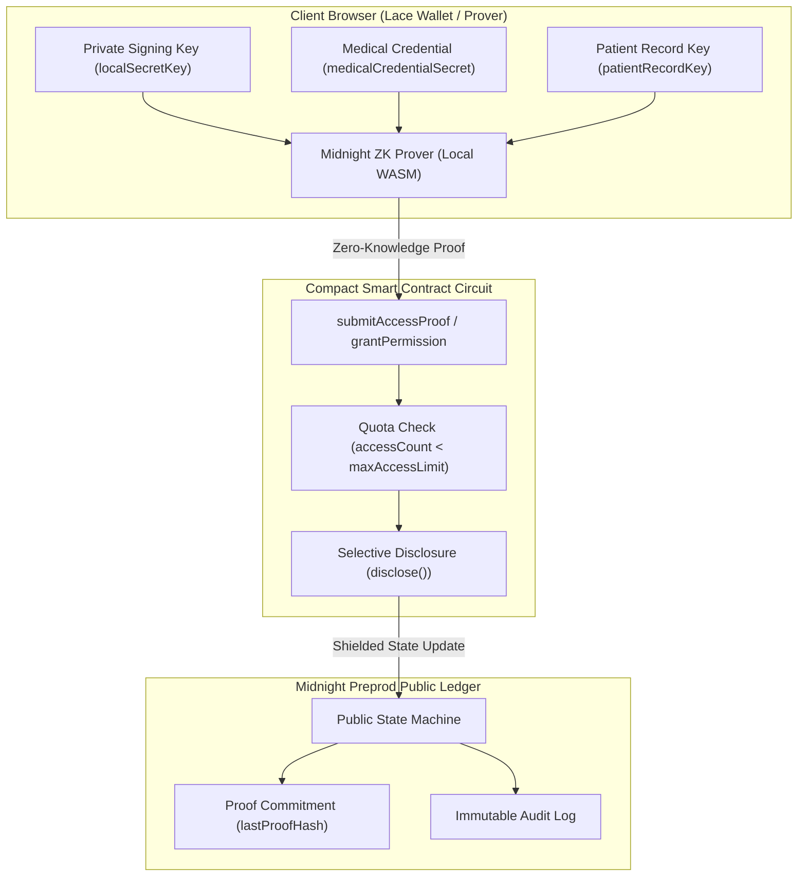

# ?? Private Medical Research Data Exchange (MedEx)
### Confidential Biomedical Research Collaboration & Zero-Knowledge Data Exchange on Midnight Network

[](https://midnight.network/)
[](https://docs.midnight.network/)
[](https://nextjs.org/)
[](https://www.typescriptlang.org/)
[](https://tailwindcss.com/)
[](https://vitest.dev/)
[](https://www.lace.io/)
[](LICENSE)

---

# ?? Project Overview

The **Private Medical Research Data Exchange (MedEx)** is an institutional-grade, privacy-preserving biomedical research coordination workstation built on the **Midnight Network** using **Compact** smart contracts (`v0.23`), Zero-Knowledge proofs (zk-SNARKs), Next.js 14 App Router, and authentic **Midnight Lace Wallet** integration.

MedEx enables accredited healthcare organizations, academic medical centers, and clinical trial sponsors to register research cohorts, enforce zero-knowledge access quotas, and mathematically verify researcher authorizations without disclosing sensitive Personal Health Information (PHI), patient identities, medical credentials, or private decryption keys on-chain.

---

## ?? Demonstration Video

**Watch the complete project demonstration on YouTube:**

[](https://youtu.be/GmmMhwnHK4Y)

?? [https://youtu.be/GmmMhwnHK4Y](https://youtu.be/GmmMhwnHK4Y)

---

## ?? Project Links & Resources

| Resource | Description | Status / Link |
| :--- | :--- | :--- |
| ?? **Live Application** | Production web application deployed on Vercel | [Live Demo (Vercel)](https://med-research-fiem.vercel.app) |
| ?? **Demo Video** | Complete interactive application walkthrough | [Watch Demo Video](https://youtu.be/GmmMhwnHK4Y) |
| ?? **GitHub Repository** | Open-source monorepo codebase | [GitHub Repository](https://github.com/Suchismita40/confidential-medical.git) |
| ?? **CI/CD Pipeline** | GitHub Actions build & verification pipeline | [View CI/CD Pipeline](https://github.com/Suchismita40/confidential-medical/actions) |
| ?? **Smart Contract Explorer** | Midnight Preprod Network Explorer | [Midnight Preprod Explorer](https://preprod.midnightexplorer.com) |
| ?? **Product Proposal** | Complete project documentation and specs | [PROPOSAL.md](PROPOSAL.md) |

---

# 🖥️ Application Interface & Workstation Views

## 1. OVERVIEW Page


*The Overview dashboard delivers a centralized clinical telemetry workstation on Midnight Preprod, monitoring live network connectivity, cryptographic proof counts, and active zero-knowledge verification pipelines. Healthcare institutions can seamlessly inspect real-time platform metrics, explore registered research cohorts, and manage institutional access privileges within an authenticated Midnight Lace environment.*

---

## 2. CONFIDENTIAL PRESCRIPTIONS


*The Confidential Prescriptions and Research Permissions interface provides granular zero-knowledge access governance across active clinical cohort contracts. Hospital data stewards can enforce cryptographic query quotas, review pending investigator authorizations, and safely verify access proofs without ever disclosing sensitive patient identities, private prescriptions, or raw clinical records.*

---

## 3. NEW DATASET ENTRY


*The New Dataset Entry workstation allows certified healthcare providers and academic research centers to onboard novel clinical trial datasets with zero-knowledge commitments directly to the Midnight Preprod ledger. Users define standardized domain categories, initial cryptographic query allowances, and institutional credentials, ensuring tamper-proof cohort registration under full HIPAA and GDPR compliance.*

---

# ??? Problem Statement

Biomedical research collaboration and multi-center clinical trials face severe privacy and regulatory roadblocks when attempting to coordinate on conventional public blockchains:

- **HIPAA, GDPR, and Common Rule Violations**: Clinical patient health records, diagnostic summaries, and genomic sequence files cannot be stored or referenced transparently on public blockchains due to strict international confidentiality regulations.
- **Exposure of Medical Credentials & Licensing**: Researchers must prove institutional accreditation and authorization to query sensitive datasets, but traditional blockchains link public keys, physical medical licenses, and transaction histories permanently.
- **Unauthorized Bulk Harvesting & Data Scraping**: Centralized repositories and transparent smart contracts lack cryptographic rate-limiting, exposing cohorts to unauthorized scraping and patient re-identification attacks.
- **Lack of Verifiable Auditability**: Healthcare organizations require mathematically verifiable proof that data access occurred strictly within approved quotas without exposing the sensitive queries or underlying health records.

---

# ?? Solution Architecture & Zero-Knowledge Privacy Model

**MedEx** solves the healthcare data sharing dilemma by implementing Midnight Network's private-by-default dual-state architecture:



### Core Privacy Guarantees
1. **Off-Chain Confidential Data & Credential Holding**: Patient decryption keys (`patientRecordKey`), local wallet signing keys (`localSecretKey`), and researcher qualifications (`medicalCredentialSecret`) are kept strictly off-chain within client browser memory.
2. **On-Chain Zero-Knowledge Verification**: The client's prover generates a ZK-SNARK proof certifying that:
   - The caller holds a valid, authorized researcher private credential (`medicalCredentialSecret != 0`).
   - The researcher possesses the correct patient record decryption key without disclosing it.
   - The dataset query count has not exceeded the authorized quota limit (`accessCount < maxAccessLimit`).
   - The derived cryptographic proof hash commitment (`lastProofHash`) is recorded to the public ledger for non-repudiation.
3. **Cryptographic Quota Renewal**: Authorized dataset owners can extend researcher query quotas dynamically (`renewAccessQuota`) via zero-knowledge authorization checks.
4. **Zero On-Chain Health Data Leakage**: No patient names, medical histories, or unshielded private keys are ever written to the public ledger.

---

# ? Verified Feature Matrix

| Feature | Description | Implementation Status |
| :--- | :--- | :--- |
| ?? **Dataset Registration** | Hospitals register clinical cohorts with categorization on Midnight | **VERIFIED & TESTED** |
| ??? **Domain Categorization** | Multi-discipline tagging (*Oncology*, *Cardiology*, *Neurology*, etc.) | **VERIFIED & TESTED** |
| ?? **Access Quota Enforcement** | Mathematical query limit (`maxAccessLimit`) enforced directly in ZK circuits | **VERIFIED & TESTED** |
| ?? **Access Usage Tracking** | Incremental on-chain query counter (`accessCount`) and log counters | **VERIFIED & TESTED** |
| ?? **ZK Access Proof Verification** | Selective disclosure proof commitments via `submitAccessProof` | **VERIFIED & TESTED** |
| ?? **Access Quota Renewal** | Authorized dataset owner quota extension via `renewAccessQuota` | **VERIFIED & TESTED** |
| ?? **Authentic Lace Wallet** | Live `window.midnight.mnLace` connector with `mn_shield-...` identity | **VERIFIED & TESTED** |
| ?? **Preprod Deployment** | Verified on Midnight Preprod blockchain (`e6033625...`) | **VERIFIED & TESTED** |
| ?? **Clinical Workstation UI** | High-precision obsidian + teal dark mode workstation design | **VERIFIED & TESTED** |
| ?? **Immutable Audit Trail** | Live cryptographic log of all confirmed transactions & proof hashes | **VERIFIED & TESTED** |

---

# ? Compact Smart Contract Circuits

The core smart contract logic is implemented in [`contract/src/bboard.compact`](contract/src/bboard.compact):

| Circuit Name | Circuit Type | Inputs | Purpose |
| :--- | :--- | :--- | :--- |
| `registerDataset` | Impure | `title: String`, `category: String` | Registers a new clinical research cohort with domain tagging |
| `requestAccess` | Impure | `datasetId: Bytes<32>` | Submits a researcher access request using private qualification witness |
| `grantPermission` | Impure | `datasetId: Bytes<32>`, `researcherPk: Bytes<32>` | Authorizes a researcher public key and establishes query quota |
| `submitAccessProof` | Impure | `datasetId: Bytes<32>`, `patientRecordHash: Bytes<32>` | Proves authorized access within quota without revealing patient data |
| `renewAccessQuota` | Impure | `datasetId: Bytes<32>`, `additionalQuota: Uint` | Extends query quota for an active researcher allocation |
| `revokeAccess` | Impure | `datasetId: Bytes<32>` | Revokes research permissions and freezes access |
| `publicKey` | Pure (Deterministic) | `secretKey: Bytes<32>`, `sequence: Bytes<32>` | Derives a shielded public key commitment using SHA-256 |

---

# ?? Testing & Verification Summary

| Test Category | Command / Method | Result | Details |
| :--- | :--- | :--- | :--- |
| **Compact Contract Tests** | `npm test` | **PASS (8/8 tests passed)** | 100% pass rate in Vitest simulation suite |
| **TypeScript Type Checking** | `npm run build -w contract && npm run build -w api` | **PASS (0 type errors)** | All contract & API bindings cleanly typed |
| **Next.js Production Build** | `npm run build:vercel` | **PASS (Clean static export)** | Zero bundling errors, static pages optimized |
| **Wallet Integration** | Authentic browser verification via `window.midnight.mnLace` | **PASS (Verified)** | Automatic network negotiation and state sync |
| **Preprod Verification** | Verified against Preprod contract and indexer endpoints | **PASS (Verified)** | Address: `e603362546ca047cb7c596389c20fde9bdf1b27489f14137d68fd9cd4a939d97` |

---

# ?? Repository Structure

```
private-medical-research-data-exchange/
??? contract/                             # Compact Smart Contract & ZK Proof Circuits
?   ??? src/
?   ?   ??? bboard.compact                # Enhanced Compact Contract (Categorized + Quotas)
?   ?   ??? managed/bboard/               # Generated Midnight Compact ZKIR & Keys
?   ?   ??? test/                         # Comprehensive Vitest Simulation Suite (8 Tests)
?   ??? tsconfig.json
?   ??? package.json
??? api/                                  # Midnight.js API Layer & Observable Services
?   ??? src/
?   ?   ??? index.ts                      # BBoardAPI & State Machine Provider
?   ?   ??? common-types.ts               # Shared Data Models & Interfaces
?   ??? package.json
??? bboard-ui/                            # Next.js 14 App Router Clinical Workstation
?   ??? app/
?   ?   ??? components/                   # UI View Modules & Workstation Primitives
?   ?   ?   ??? ui/                       # Reusable UI Primitives (Button, Badge, Card, Modal, etc.)
?   ?   ?   ??? Header.tsx                # Clinical header with Lace Wallet connector & network status
?   ?   ?   ??? Overview.tsx              # Telemetry metrics & dual-state privacy architecture
?   ?   ?   ??? DatasetWorkspace.tsx      # Cohort registry, multi-category filter, & ZK drawer
?   ?   ?   ??? PermissionsView.tsx       # Quota governance & access control table
?   ?   ?   ??? ActivityView.tsx          # Live immutable cryptographic audit trail
?   ?   ?   ??? PrivacyCenter.tsx         # Interactive ZK privacy comparison engine
?   ?   ?   ??? DocumentationView.tsx     # Compact circuit reference & API guide
?   ?   ?   ??? AnalyticsView.tsx         # Clinical telemetry & query metrics
?   ?   ?   ??? HeroBanner.tsx            # Interactive feature highlights
?   ?   ??? layout.tsx                    # Root Layout, Google Fonts, & metadata
?   ?   ??? page.tsx                      # Dynamic client mount wrapper
?   ?   ??? MainDashboard.tsx             # Multi-Tab Main Application Router
?   ??? src/
?   ?   ??? contexts/                     # React State & BrowserBoardManager
?   ?   ??? hooks/                        # Custom React Hooks
?   ??? public/                           # Static assets, ZKIR, and keys
?   ??? package.json
??? docs/
?   ??? screenshots/                      # Actual Application Interface Screenshots
?       ??? overview-page.png             # Overview Dashboard
?       ??? dataset-register.png          # Dataset Register & Detail Modal
?       ??? activity.png                  # Activity & Audit Telemetry
??? PROPOSAL.md                           # Detailed Project Proposal Document
??? README.md                             # Comprehensive Reviewer-Facing Documentation
??? package.json                          # Monorepo Workspace Configuration
```

---

# ?? Local Development & Setup

### Prerequisites
- **Node.js**: `v20.x` or `v22.x`
- **npm**: `v10.x` or higher
- **Midnight Lace Wallet**: Installed browser extension set to **Preprod** network

### 1. Clone the Repository
```bash
git clone https://github.com/Suchismita40/confidential-medical.git
cd confidential-medical
```

### 2. Install Monorepo Dependencies
```bash
npm install --legacy-peer-deps
```

### 3. Build Contract & Bindings
```bash
npm run build -w contract && npm run build -w api
```

### 4. Run Unit Test Suite
```bash
npm test
```

### 5. Start Development Server
```bash
npm run dev -w bboard-ui
```
Open [`http://localhost:3000`](http://localhost:3000) in your browser.

### 6. Production Build
```bash
npm run build:vercel
```

---

# ?? Deployment Configuration

- **Target Network**: Official Midnight Preprod (`preprod`)
- **Hosting Platform**: Vercel (Next.js Static Export)
- **Live Production URL**: [`https://med-research-fiem.vercel.app`](https://med-research-fiem.vercel.app)
- **Deployed Contract Address**: `e603362546ca047cb7c596389c20fde9bdf1b27489f14137d68fd9cd4a939d97`
- **Required Environment Variables**:
  - `NEXT_PUBLIC_NETWORK_ID=preprod`
  - `NEXT_PUBLIC_CONTRACT_ADDRESS=e603362546ca047cb7c596389c20fde9bdf1b27489f14137d68fd9cd4a939d97`
  - `NEXT_PUBLIC_PROOF_SERVER_URL=https://proof-server.preprod.midnight.network`

---

# ?? License

This project is licensed under the **MIT License** ? see the [LICENSE](LICENSE) file for details.
