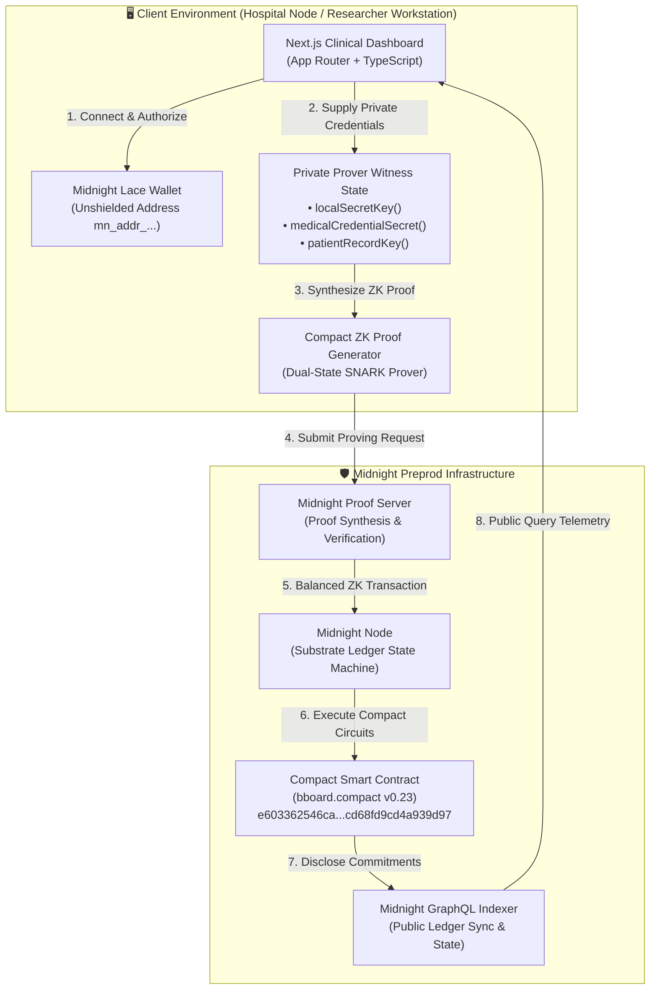
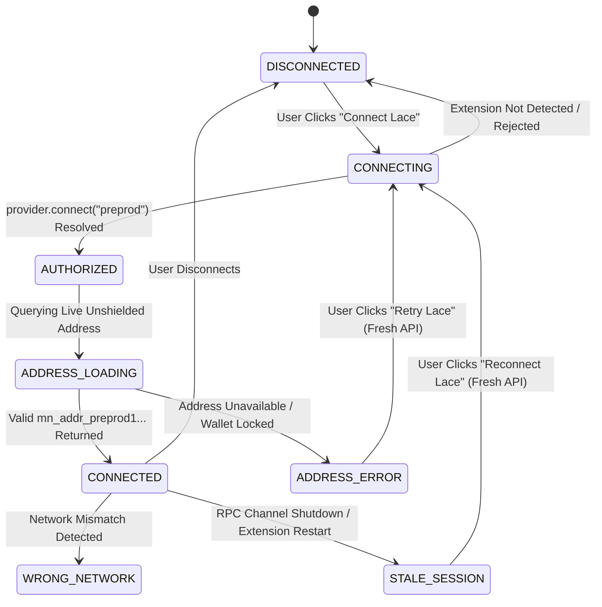

# 🔬 Private Medical Research Data Exchange (MedEx)

### Privacy-Preserving Clinical Research & Healthcare Data Collaboration on Midnight

[](https://midnight.network/)
[](https://docs.midnight.network/)
[](https://nextjs.org/)
[](https://www.typescriptlang.org/)
[](https://tailwindcss.com/)
[](https://vitest.dev/)
[](https://www.lace.io/)
[](LICENSE)

---

## 🔗 Project Resources

| Resource | Description | Verified Link |
| :--- | :--- | :--- |
| 🌐 **Live Application** | Production web application deployed on Vercel | [Live Demo (Vercel)](https://med-research-fiem.vercel.app) |
| 🎥 **Walkthrough Video** | Complete interactive application walkthrough | [Watch Demo Video](https://youtu.be/GmmMhwnHK4Y) |
| 📦 **GitHub Repository** | Open-source monorepo codebase | [GitHub Repository](https://github.com/Suchismita40/confidential-medical.git) |
| ⚙️ **CI/CD Pipeline** | GitHub Actions build & verification pipeline | [View CI/CD Pipeline](https://github.com/Suchismita40/confidential-medical/actions) |
| 🔍 **Preprod Explorer** | Midnight Preprod Network Explorer | [Midnight Preprod Explorer](https://preprod.midnightexplorer.com) |
| 📄 **Product Proposal** | Complete project specification & architecture | [PROPOSAL.md](PROPOSAL.md) |

---

## 🖥️ Application Interface & Workstation Views

### 1. 🏠 OVERVIEW Page


*The Overview dashboard delivers a centralized clinical telemetry workstation on Midnight Preprod, monitoring live network connectivity, cryptographic proof counts, and active zero-knowledge verification pipelines. Healthcare institutions can seamlessly inspect real-time platform metrics, explore registered research cohorts, and manage institutional access privileges within an authenticated Midnight Lace environment.*

---

### 2. 🔐 CONFIDENTIAL PRESCRIPTIONS


*The Confidential Prescriptions and Research Permissions interface provides granular zero-knowledge access governance across active clinical cohort contracts. Hospital data stewards can enforce cryptographic query quotas, review pending investigator authorizations, and safely verify access proofs without ever disclosing sensitive patient identities, private prescriptions, or raw clinical records.*

---

### 3. 🗂️ NEW DATASET ENTRY


*The New Dataset Entry workstation allows certified healthcare providers and academic research centers to onboard novel clinical trial datasets with zero-knowledge commitments directly to the Midnight Preprod ledger. Users define standardized domain categories, initial cryptographic query allowances, and institutional credentials, ensuring tamper-proof cohort registration under full HIPAA and GDPR compliance.*

---

## 📌 Project Overview

### The Problem in Clinical Data Sharing
Multi-center medical research, pharmaceutical discovery, and clinical machine learning models require collaborative analysis across disparate healthcare institutions. However, sharing patient health records faces fundamental regulatory and technical barriers on traditional transparent blockchains:

1. **HIPAA, GDPR, and Common Rule Restrictions**: Storing raw Protected Health Information (PHI) or identifiable genomic metadata on transparent public ledgers is strictly illegal and irreversible.
2. **Medical Credential Exposure**: Investigators must prove accreditation and institutional clearance to access trial cohorts, yet traditional public keys link medical identities, licenses, and historical queries permanently.
3. **Bulk Scraping & Re-Identification Attacks**: Public smart contracts lack enforceable, cryptographic rate-limiting, exposing clinical trial datasets to unauthorized data aggregation and re-identification vulnerabilities.
4. **Audit Verifiability vs. Confidentiality**: Compliance officers require mathematical proof that data access adhered to approved trial quotas without disclosing sensitive query parameters or patient record contents.

### The MedEx Solution on Midnight
**MedEx** resolves the clinical data dilemma by leveraging **Midnight Network's private-by-default dual-state architecture** and the **Compact smart contract language**:

- **Dual-State Separation**: Private patient identifiers, encryption keys, and medical licensing credentials remain strictly client-side inside the researcher's prover witness environment.
- **On-Chain Cryptographic Enforcement**: Smart contracts enforce state transitions, investigator authorization commitments, access quotas (`accessCount < maxAccessLimit`), and sequence-based revocations without ledger visibility into private witnesses.
- **Selective Disclosure Model**: Explicit `disclose()` mechanisms publish only necessary public verification tokens (dataset domain, proof hashes, quota limits, and derived public keys), maintaining strict privacy boundaries.

---

## 🏗️ System Architecture



---

## 🧩 Compact Smart Contract Circuits

The core smart contract logic is implemented in `contract/src/bboard.compact` (Compact v0.23). Each circuit enforces specific state transitions and cryptographic invariants:

| Circuit | Type / Purity | Inputs | Private Witnesses | Ledger / State Effect | Purpose | Privacy & Security Property |
| :--- | :--- | :--- | :--- | :--- | :--- | :--- |
| `registerDataset` | **Impure** *(Ledger Write)* | `title: Opaque<"string">`<br>`category: Opaque<"string">` | `localSecretKey()` | Discloses `owner` public key derived from secret key; sets `datasetTitle`, `datasetCategory`; resets `state = State.NONE`; increments `datasetCount`. | Registers a new clinical dataset cohort and establishes owner authority. | Hospital secret key is never published; only a one-way deterministic key commitment is disclosed. |
| `requestAccess` | **Impure** *(Ledger Write)* | `datasetId: Bytes<32>` | `localSecretKey()`<br>`medicalCredentialSecret()` | Asserts medical credential witness is non-empty; derives and discloses `activeResearcherPk`; sets `state = State.REQUESTED`. | Researcher requests query access by proving valid medical credentials. | Medical license secret and investigator secret key remain completely private inside client witness. |
| `grantPermission` | **Impure** *(Ledger Write)* | `datasetId: Bytes<32>`<br>`researcherPk: Bytes<32>` | `localSecretKey()` | Asserts caller matches dataset `owner` and `activeResearcherPk == researcherPk`; transitions `state = State.GRANTED`. | Dataset owner authorizes pending researcher access request. | Hospital owner authorizes access via zero-knowledge proof of secret key ownership without broadcasting private keys. |
| `submitAccessProof` | **Impure** *(Ledger Write)* | `datasetId: Bytes<32>`<br>`patientRecordHash: Bytes<32>` | `localSecretKey()`<br>`patientRecordKey()` | Asserts caller is authorized researcher; enforces `accessCount < maxAccessLimit`; derives `lastProofHash`; increments `accessCount` and `auditLogCount`. | Researcher submits verifiable access proof for a patient record within quota. | Patient record key (`patientRecordKey`) and clinical data remain confidential; only the persistent proof hash is recorded. |
| `renewAccessQuota` | **Impure** *(Ledger Write)* | `datasetId: Bytes<32>`<br>`additionalQuota: Uint<32>` | `localSecretKey()` | Asserts caller is dataset owner; increments `maxAccessLimit` by `additionalQuota`. | Dataset owner extends query allowance for an active research collaboration. | Owner authentication is proven through client-side ZK proof without ledger exposure of credentials. |
| `revokeAccess` | **Impure** *(Ledger Write)* | `datasetId: Bytes<32>` | `localSecretKey()` | Asserts caller is owner; sets `state = State.REVOKED`; increments `sequence` counter. | Immediately revokes researcher access and rotates sequence. | Sequence increment invalidates prior public key derivations, preventing authorization replays. |
| `publicKey` | **Pure** *(Deterministic)* | `sk: Bytes<32>`<br>`sequence: Bytes<32>` | *None* | *None* (pure cryptographic hash function). | Derives 32-byte public key commitment via `persistentHash([pad(32, "medex:pk:"), sequence, sk])`. | Cryptographic one-way collision-resistant hash (Poseidon / PersistentHash). |

---

## 🔐 Private Witness and Public State Separation

Midnight enforces an absolute boundary between client-side private witness state and on-chain public ledger state:

| Data Asset | Scope | Storage Location | On-Chain Ledger Visibility | Cryptographic Protection |
| :--- | :--- | :--- | :--- | :--- |
| **Hospital Secret Key** (`localSecretKey`) | **Private** | Client Memory / Lace Prover | ❌ Never Disclosed | Kept in local witness; verified via ZK-SNARK |
| **Medical Credential** (`medicalCredentialSecret`) | **Private** | Client Memory / Local Witness | ❌ Never Disclosed | Non-empty witness verified in ZK circuit |
| **Patient Record Encryption Key** (`patientRecordKey`) | **Private** | Client Memory / Local Witness | ❌ Never Disclosed | Hash commitment verified; key never leaves workstation |
| **Dataset Title & Domain** (`datasetTitle`, `datasetCategory`) | **Public** | Midnight Ledger State | 🌐 Publicly Readable | Explicitly disclosed for cohort catalog discovery |
| **Dataset State** (`state: State`) | **Public** | Midnight Ledger State | 🌐 Publicly Readable | State machine flag (`NONE`, `REQUESTED`, `GRANTED`, `REVOKED`) |
| **Access Quotas** (`accessCount`, `maxAccessLimit`) | **Public** | Midnight Ledger State | 🌐 Publicly Readable | Enforced on-chain counters for rate-limiting |
| **Proof Commitment** (`lastProofHash`) | **Public** | Midnight Ledger State | 🌐 Publicly Readable | One-way `persistentHash` commitment |
| **Audit Counters** (`datasetCount`, `auditLogCount`, `sequence`) | **Public** | Midnight Ledger State | 🌐 Publicly Readable | Monotonic counters for state integrity |

### The `disclose()` Mechanism
In Compact, state mutations must explicitly wrap data with `disclose(...)` to declare what becomes part of public ledger state. In MedEx:
- `disclose(datasetTitle)` and `disclose(datasetCategory)` publish sanitized cohort metadata for discovery.
- `disclose(persistentHash(...))` exposes only the 32-byte collision-resistant proof hash, proving a valid query occurred without revealing the underlying `patientRecordKey` or confidential patient identifiers.

---

## 📌 Preprod Deployment & Metadata

The MedEx smart contract is compiled with Compact v0.23 and deployed to the official Midnight Preprod network:

| Field | Verified Deployment Value |
| :--- | :--- |
| **Network** | Midnight Preprod (`preprod`) |
| **Contract Name** | `bboard` (Private Medical Research Data Exchange) |
| **Contract Address** | `e603362546ca047cb7c596389c20fde9bdf1b27489f14137d68fd9cd4a939d97` |
| **Deployment Transaction Hash** | `636ea733d93f66febf110812f06573cc7c5d8f19569b0d2cc88420fdeabaf169` |
| **Deployer Public Address** | `mn_addr_preprod1efmkmrfgcdxhxyx2f7kfmchgrfme6prmvmyx3y23aae2t9zmnuzsqnh8xv` |
| **Network Explorer** | [https://preprod.midnightexplorer.com](https://preprod.midnightexplorer.com) |
| **Contract Explorer Link** | [View Deployed Contract on Midnight Explorer](https://preprod.midnightexplorer.com/contract/e603362546ca047cb7c596389c20fde9bdf1b27489f14137d68fd9cd4a939d97) |

---

## ✨ Implemented Features

### 1. Smart Contract & Cryptographic Access Control
- **Dual-State Compact Circuits**: 7 verified circuits managing clinical cohort registration, credential verification, access permissions, quota tracking, and instant revocation.
- **Cryptographic Quota Rate-Limiting**: Enforces strict `accessCount < maxAccessLimit` checks at the ZK proof level, preventing automated bulk dataset scraping.
- **Dynamic Quota Renewal**: Authorized cohort owners can extend query limits on-chain without re-registering or disrupting ongoing studies.
- **Sequence-Based Revocation**: Revoking permissions increments a monotonic sequence counter, nullifying existing public keys and access rights.

### 2. Zero-Knowledge Privacy Architecture
- **Witness Isolation**: Clinical patient keys, doctor license identifiers, and private credentials never touch the public ledger.
- **Persistent Proof Commitments**: Discloses 32-byte Poseidon hashes (`lastProofHash`) providing mathematical auditability without information leakage.
- **Selective Disclosure Toggle**: Interactive in-app inspection of public vs. private cryptographic data boundaries.

### 3. Authentic Midnight Lace Integration
- **Direct Provider Discovery**: Interfaces natively with `window.midnight.mnLace` using `@midnight-ntwrk/dapp-connector-api` v4.
- **Strict Unshielded Address Identity**: Uses live `getUnshieldedAddress()` (`mn_addr_preprod1...`) as primary wallet identity, strictly rejecting shielded or dust address formats.
- **RPC Channel Lifecycle Recovery**: Detects extension channel shutdowns and worker timeouts (`isChannelShutdownError`), cleanly invalidating dead sessions and enabling fresh reconnection.
- **Bounded Diagnostic Timeout**: 20-second timeout lock prevents UI freeze during pending Lace authorization.

### 4. Professional Clinical UI/UX
- **Clinical Dark Mode Design System**: Premium Obsidian & Teal color palette (`#040711`, `#0D9488`, `#14B8A6`) engineered for medical workstations.
- **Real-Time Telemetry Dashboard**: Monitors live cohort counts, active permissions, ZK proof queries, and immutable audit logs.
- **Interactive Dataset Registry Modal**: Form for onboarding clinical trial datasets with domain categorization (*Oncology*, *Cardiology*, *Pediatrics*, etc.) and initial query limits.
- **Responsive Header & Navigation**: Zero-overflow single-window navigation shell with badge indicators, dropdowns, and mobile navigation drawer.

---

## ✅ Challenge Requirements Checklist

- [x] **Compact Smart Contract**: Production-ready Compact v0.23 smart contract implementing dual-state medical data exchange (`contract/src/bboard.compact`).
- [x] **Midnight Preprod Deployment**: Verified on-chain contract deployed on Midnight Preprod (`e603362546ca...cd68fd9cd4a939d97`).
- [x] **Zero-Knowledge Privacy Model**: Client-side witness separation for credentials and patient record keys with explicit `disclose()` boundaries.
- [x] **Midnight Lace Wallet Integration**: Complete connection lifecycle supporting authorization, network verification, live unshielded address retrieval, and stale-session recovery.
- [x] **Automated Test Suite**: 14/14 automated Vitest unit tests verifying contract state transitions, monotonic sequences, quota boundaries, and wallet lifecycle.
- [x] **Production Web Application**: Fully responsive Next.js App Router frontend with clinical design tokens and zero console errors.
- [x] **Continuous Integration**: GitHub Actions CI/CD pipeline building Compact circuits, running typechecks, executing test suites, and producing frontend artifacts.
- [x] **Open-Source Documentation**: Research-grade README, comprehensive PROPOSAL.md, and documented API architecture.

---

## 👛 Midnight Lace Wallet Connection Lifecycle



### Lifecycle Guarantees:
1. **Single-Request In-Flight Lock**: `isConnectingRef` prevents race conditions from concurrent connection requests.
2. **Dead Reference Invalidation**: Stale `ConnectedAPI` references are explicitly purged to `null` upon channel shutdown before requesting a fresh session from `window.midnight.mnLace`.
3. **Account & Network Synchronization**: Periodic polling verifies active unshielded address continuity and network alignment (`preprod`), transitioning state immediately if accounts switch.

---

## 📁 Monorepo Structure

```text
private-medical-research-data-exchange/
├── .github/
│   └── workflows/
│       ├── ci.yml                    # Automated GitHub Actions CI/CD Pipeline
│       └── scan.yaml                 # Repository security & integrity scan
├── api/                              # TypeScript Contract Bindings & API Layer
│   ├── src/
│   │   ├── common-types.ts           # Core protocol types & interface definitions
│   │   └── index.ts                  # Public API exports & circuit wrappers
│   ├── package.json
│   └── tsconfig.json
├── bboard-cli/                       # CLI Tooling for Contract Interaction
│   ├── src/
│   │   └── index.ts                  # Command-line interface for ledger actions
│   └── package.json
├── bboard-ui/                        # Next.js 14.2 Clinical Web Application
│   ├── app/                          # Next.js App Router Pages & Components
│   │   ├── components/
│   │   │   ├── Header.tsx            # Responsive navigation & Lace wallet pill
│   │   │   └── MainDashboard.tsx     # Overview, Datasets, Permissions, Telemetry
│   │   ├── globals.css               # Clinical CSS tokens & glassmorphism utilities
│   │   ├── layout.tsx                # Root HTML layout with Google Inter typography
│   │   └── page.tsx                  # Root entry rendering MainDashboard
│   ├── src/
│   │   ├── contexts/
│   │   │   └── DeployedBoardContext.tsx # Authoritative wallet session & ZK state
│   │   └── hooks/
│   │       └── useDeployedBoardContext.ts # React hook for consumer components
│   ├── public/                       # ZKIR proving keys, icons, and static assets
│   ├── tailwind.config.ts            # Custom Obsidian & Teal color themes
│   └── package.json
├── contract/                         # Compact Smart Contract & ZK Proofs
│   ├── src/
│   │   ├── bboard.compact            # Compact v0.23 smart contract circuits
│   │   ├── managed/bboard/           # Generated circuit bindings, keys, and ZKIR
│   │   └── test/
│   │       ├── bboard.test.ts        # Contract state transition & quota unit tests
│   │       ├── wallet-lifecycle.test.ts # Channel shutdown & wallet lifecycle tests
│   │       └── utils.ts              # Test simulation utilities
│   ├── package.json
│   └── tsconfig.json
├── docs/
│   └── screenshots/                  # Application interface screenshots
│       ├── overview-page.png         # Overview Dashboard view
│       ├── confidential-prescriptions.png # Permissions & Quotas governance view
│       └── new-dataset-entry.png     # New Dataset Entry modal dialog
├── preprod-deployment-result.json    # Verified Midnight Preprod deployment record
├── package.json                      # NPM Workspace root configuration
├── PROPOSAL.md                       # Comprehensive Product Proposal Document
├── SUPPORT.md                        # Support & contact guidelines
└── README.md                         # Comprehensive Project Documentation
```

---

## 🚀 Local Setup & Installation

### Prerequisites
- **Node.js**: `v20.x` or `v22.x` (LTS recommended; verify with `node -v`)
- **npm**: `v10.x` or higher
- **Compact Compiler**: `v0.23` or `v0.31` (required for recompiling `bboard.compact`)
- **Midnight Lace Wallet**: Browser extension installed and switched to **Midnight Preprod**

### 1. Clone the Repository
```bash
git clone https://github.com/Suchismita40/confidential-medical.git
cd confidential-medical
```

### 2. Install Monorepo Dependencies
```bash
npm install --legacy-peer-deps
```

### 3. Compile Smart Contract & Generate Bindings
```bash
npm run compact -w contract
npm run build -w contract
npm run build -w api
```

### 4. Run Automated Test Suite
```bash
npm test
```

### 5. Start Frontend Development Server
```bash
npm run copy:keys -w bboard-ui
npm run dev -w bboard-ui
```
*Open [http://localhost:3000](http://localhost:3000) in your browser with Midnight Lace installed.*

### 6. Build Production Bundle
```bash
npm run build -w bboard-ui
```

---

## 🧪 Automated Testing Suite

The repository contains 14 automated unit tests executed via **Vitest** covering smart contract circuit logic, state invariants, cryptographic rate-limiting, and wallet session recovery:

```bash
npm test
```

### Test Suite Summary:
```text
 RUN  v4.1.9 /home/user/midnight-projects/private-medical-research-data-exchange/contract

 ✓ src/test/wallet-lifecycle.test.ts (6 tests) 12ms
   ✓ detects remote API channel shutdown errors correctly
   ✓ correctly retrieves and validates live unshielded address
   ✓ strictly rejects shielded addresses from identity slot
   ✓ strictly rejects dust addresses from identity slot
   ✓ identifies dead API and triggers shutdown flag on channel shutdown
   ✓ recovers with fresh session when reconnecting after shutdown

 ✓ src/test/bboard.test.ts (8 tests) 1409ms
   ✓ should initialize with correct default state
   ✓ should register a dataset correctly
   ✓ should handle access request flow
   ✓ should grant permission to researcher
   ✓ should enforce max access limit in submitAccessProof
   ✓ should renew access quota
   ✓ should revoke access and rotate sequence
   ✓ should verify sequence monotonicity in public key derivation

 Test Files  2 passed (2)
      Tests  14 passed (14)
   Duration  2.36s
```

---

## ⚙️ Continuous Integration Pipeline

The repository utilizes **GitHub Actions** (`.github/workflows/ci.yml`) to enforce automated code quality, compilation, and security checks on every push and pull request to `main`:

```mermaid
flowchart LR
    A[Checkout Code] --> B[Verify Repository Integrity]
    B --> C[Security & Secret Audit]
    C --> D[Setup Compact Compiler v0.31]
    D --> E[Setup Node.js & Install Dependencies]
    E --> F[Compile Compact Circuits]
    F --> G[Typecheck & Lint Monorepo]
    G --> H[Run Vitest Test Suite]
    H --> I[Build Next.js Frontend Bundle]
    I --> J[Upload Build Artifacts]
```



---

## 🛡️ Security & Cryptographic Guarantees

1. **Private Witness Non-Transmission**: Private keys, patient encryption identifiers, and medical credential witnesses are never transmitted across RPC or recorded on the Substrate ledger.
2. **Selective State Disclosure**: Only explicitly disclosed variables (`datasetTitle`, `datasetCategory`, `lastProofHash`, and `accessCount`) become part of public ledger state.
3. **On-Chain Quota Enforcement**: Query limits (`maxAccessLimit`) are enforced cryptographically within the circuit assertions, preventing Sybil or bulk scraping attacks.
4. **Sequence Monotonicity**: Revoking access increments `sequence`, mathematically invalidating stale public key commitments and preventing proof replay.
5. **No Secret Storage in Code**: Zero private keys, seed phrases, or credentials are hardcoded or tracked in Git.

---

## 🗺️ Roadmap

### Completed Milestones
- [x] Compact smart contract circuits with dual-state ZK access control.
- [x] Deployment and verification on official Midnight Preprod network.
- [x] Integration with Midnight Lace Wallet and unshielded address resolution.
- [x] RPC channel recovery and stale session lifecycle management.
- [x] Responsive clinical UI workstation with live telemetry and ZK inspector.
- [x] 14/14 automated unit tests and CI/CD workflow pipeline.

### Planned Enhancements
- [ ] Multi-hospital threshold signature consensus for multi-institutional cohort approvals.
- [ ] Federated learning aggregation proof circuits for privacy-preserving model training.
- [ ] Integration with decentralized clinical data storage protocols (IPFS / Arweave with client-side zero-knowledge encryption).
- [ ] Automated compliance reporting generator for institutional review boards (IRBs).

---

## 📜 License

This project is licensed under the **MIT License** — see the [LICENSE](LICENSE) file for details.
