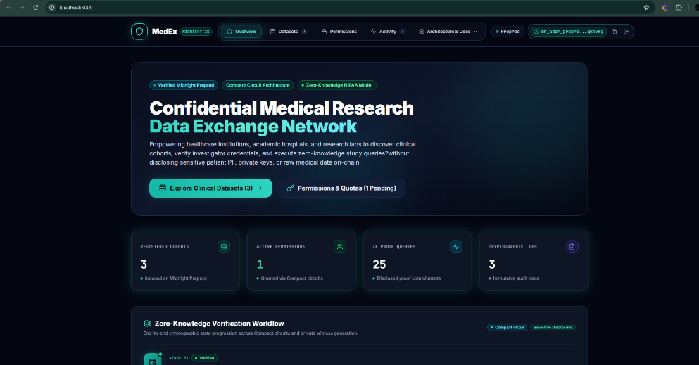
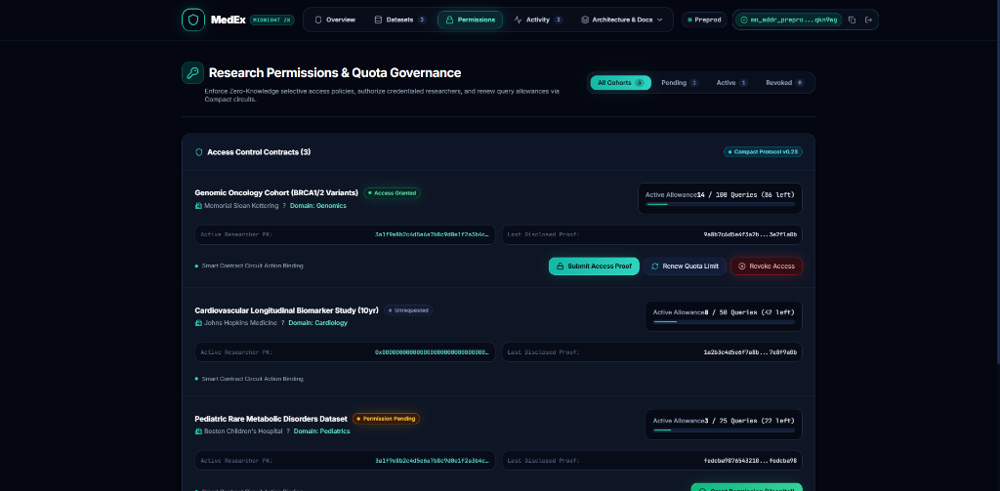
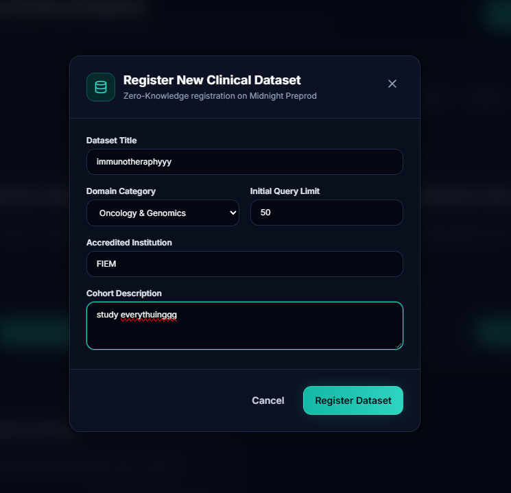

# 🔬 Private Medical Research Data Exchange (MedEx)

### Privacy-Preserving Clinical Research & Healthcare Data Collaboration on Midnight

[](https://midnight.network/)
[](https://docs.midnight.network/)
[](https://nextjs.org/)
[](https://www.typescriptlang.org/)
[](https://tailwindcss.com/)
[](https://vitest.dev/)
[](https://www.lace.io/)
[](LICENSE)

**MedEx (Private Medical Research Data Exchange)** is a zero-knowledge clinical data governance platform engineered on the **Midnight Network**. MedEx resolves the tension between medical research collaboration and patient privacy regulations (such as HIPAA and GDPR) by leveraging Compact smart contracts, zero-knowledge proofs (ZK-SNARKs), and dual-state architecture. Healthcare institutions can safely register research cohorts, enforce cryptographic query quotas, and verify investigator credentials without ever exposing raw patient records, medical license secrets, or private decryption keys to public ledgers.

---

## 🎥 Demo Video

Experience the end-to-end interactive workflow of MedEx, demonstrating clinical dataset onboarding, researcher credential verification, zero-knowledge access proof generation, and real-time quota governance on Midnight Preprod:

[](https://youtu.be/GmmMhwnHK4Y)

> 📺 **Direct Video URL**: [https://youtu.be/GmmMhwnHK4Y](https://youtu.be/GmmMhwnHK4Y)

---

## 🔗 Project Links

| Resource | Description | Status / Link |
| :--- | :--- | :--- |
| 🌐 **Live Web Application** | Production-ready clinical workstation deployed on Vercel | [https://med-research-fiem.vercel.app](https://med-research-fiem.vercel.app) |
| 🎥 **Walkthrough Video** | End-to-end video demonstration of MedEx features | [YouTube Walkthrough](https://youtu.be/GmmMhwnHK4Y) |
| 📦 **GitHub Repository** | Verified open-source monorepo codebase | [Suchismita40/confidential-medical](https://github.com/Suchismita40/confidential-medical.git) |
| ⚙️ **CI/CD Pipeline** | GitHub Actions build, test, and security workflows | [GitHub Actions CI](https://github.com/Suchismita40/confidential-medical/actions) |
| 🔍 **Preprod Explorer** | Midnight Preprod Contract & Ledger Explorer | [Midnight Preprod Explorer](https://preprod.midnightexplorer.com) |
| 📄 **Product Proposal** | Formal architecture specification and product proposal | [PROPOSAL.md](PROPOSAL.md) |
| 🛡️ **Support & Guidelines** | Security and maintainer support documentation | [SUPPORT.md](SUPPORT.md) |

---

## 🖥️ Application Interface & Workstation Views

### 1. 🏠 OVERVIEW Page


*The Overview dashboard delivers a centralized clinical telemetry workstation on Midnight Preprod, monitoring live network connectivity, cryptographic proof counts, and active zero-knowledge verification pipelines. Healthcare institutions can seamlessly inspect real-time platform metrics, explore registered research cohorts, and manage institutional access privileges within an authenticated Midnight Lace environment.*

---

### 2. 🔐 CONFIDENTIAL PRESCRIPTIONS


*The Confidential Prescriptions and Research Permissions interface provides granular zero-knowledge access governance across active clinical cohort contracts. Hospital data stewards can enforce cryptographic query quotas, review pending investigator authorizations, and safely verify access proofs without ever disclosing sensitive patient identities, private prescriptions, or raw clinical records.*

---

### 3. 🗂️ NEW DATASET ENTRY


*The New Dataset Entry workstation allows certified healthcare providers and academic research centers to onboard novel clinical trial datasets with zero-knowledge commitments directly to the Midnight Preprod ledger. Users define standardized domain categories, initial cryptographic query allowances, and institutional credentials, ensuring tamper-proof cohort registration under full HIPAA and GDPR compliance.*

---

## 📌 Project Overview

### The Problem with Public Blockchains
Collaborative biomedical research and clinical machine learning models require accessing datasets spread across diverse medical centers. However, sharing patient health records faces fundamental regulatory and technical barriers on traditional transparent blockchains:

1. **Regulatory Non-Compliance (HIPAA & GDPR)**: Publishing Protected Health Information (PHI), diagnostic histories, or identifiable genomic metadata on transparent public ledgers violates privacy mandates and is permanently irreversible.
2. **Medical Credential Exposure**: Investigators must prove institutional accreditation and active clinical licensing to query trial cohorts, yet public key architectures link real-world medical identities, institutional affiliations, and query logs indefinitely.
3. **Bulk Scraping & Re-Identification Attacks**: Public smart contracts lack enforceable, cryptographic rate-limiting, leaving clinical datasets vulnerable to Sybil-driven data aggregation and correlation attacks.
4. **Auditability vs. Confidentiality Trade-Off**: Institutional Review Boards (IRBs) require mathematical proof that data access adhered to approved protocols without disclosing the confidential clinical records or query payloads.

### The Midnight Zero-Knowledge Solution
**MedEx** resolves these challenges by leveraging **Midnight Network's dual-state architecture** and the **Compact smart contract language**:

- **Private Prover Witness Isolation**: Private patient record encryption keys, doctor licensing secrets, and private institutional keys execute exclusively inside the researcher's local prover environment.
- **On-Chain Cryptographic Access Invariants**: Smart contracts enforce state machine transitions, investigator authorization commitments, access quotas (`accessCount < maxAccessLimit`), and sequence-based revocations without ledger visibility into private witnesses.
- **Selective Disclosure Model**: Explicit `disclose()` primitives ensure only necessary public verification tokens (dataset domain, proof hashes, quota limits, and derived public keys) reach the Substrate ledger, providing complete mathematical auditability with zero data leakage.

---

## ✨ Features

### 1. 🧬 Confidential Dataset Registration & Discovery
- **Implemented In**: `contract/src/bboard.compact` (`registerDataset`), `bboard-ui/app/components/MainDashboard.tsx`
- **Functionality**: Healthcare providers register clinical research cohorts (e.g. *Oncology*, *Cardiology*, *Genomics*) with initial query limits while keeping the hospital's signing key confidential. Discloses only dataset domain metadata and one-way key commitments.

### 2. 🔐 Zero-Knowledge Access Request & Credential Verification
- **Implemented In**: `contract/src/bboard.compact` (`requestAccess`), `bboard-ui/app/components/MainDashboard.tsx`
- **Functionality**: Researchers prove possession of valid medical licensing credentials (`medicalCredentialSecret != ""` and valid secret key) in zero-knowledge. Derives an ephemeral `activeResearcherPk` commitment without broadcasting raw credentials.

### 3. 🛡️ Permission Granting & Role-Based Authorization
- **Implemented In**: `contract/src/bboard.compact` (`grantPermission`), `bboard-ui/app/components/MainDashboard.tsx`
- **Functionality**: Dataset owners verify and authorize pending research requests on-chain. Validates that the caller holds the private key matching the dataset's `owner` commitment before granting access.

### 4. 📊 Cryptographic Access Quota Enforcement & Rate-Limiting
- **Implemented In**: `contract/src/bboard.compact` (`submitAccessProof`), `bboard-ui/app/components/MainDashboard.tsx`
- **Functionality**: Limits researcher queries by enforcing `accessCount < maxAccessLimit` inside the ZK circuit. Generates a 32-byte Poseidon hash (`lastProofHash`) committing to the patient record query without disclosing the underlying `patientRecordKey`.

### 5. 🔄 Dynamic Quota Renewal
- **Implemented In**: `contract/src/bboard.compact` (`renewAccessQuota`), `bboard-ui/app/components/MainDashboard.tsx`
- **Functionality**: Cohort owners can extend query limits (`maxAccessLimit.increment(disclose(additionalQuota))`) on-chain without restarting active studies or re-verifying credentials.

### 6. 🚫 Sequence-Based Instant Access Revocation
- **Implemented In**: `contract/src/bboard.compact` (`revokeAccess`), `bboard-ui/app/components/MainDashboard.tsx`
- **Functionality**: Hospital administrators can revoke access permissions instantly. Increments a monotonic `sequence` counter on-chain, mathematically invalidating prior public key derivations and preventing replay attacks.

### 7. 📜 Immutable Audit Trail & Telemetry
- **Implemented In**: `contract/src/bboard.compact` (`auditLogCount`, `datasetCount`), `bboard-ui/app/components/MainDashboard.tsx`
- **Functionality**: Real-time telemetry monitoring total registered cohorts, active permission states, cryptographic query proofs, and ledger audit logs.

### 8. 👛 Authentic Midnight Lace Integration & Stale-Session Protection
- **Implemented In**: `bboard-ui/src/contexts/DeployedBoardContext.tsx`, `contract/src/test/wallet-lifecycle.test.ts`
- **Functionality**: Native integration with `@midnight-ntwrk/dapp-connector-api` v4. Resolves live unshielded addresses (`mn_addr_preprod1...`), detects extension RPC channel shutdowns (`isChannelShutdownError`), and performs seamless clean-session recovery.

---

## ✅ Challenge Requirements Checklist

- [x] **Compact Smart Contract**: Production-ready Compact v0.23 smart contract implementing dual-state medical data exchange (`contract/src/bboard.compact`).
- [x] **Zero-Knowledge Privacy Separation**: Strict isolation between client-side private witness state and public on-chain ledger state.
- [x] **Explicit `disclose()` Mechanisms**: Documented, verified use of `disclose()` for selective state disclosure in Compact circuits.
- [x] **Midnight Lace Wallet Integration**: Complete connection lifecycle with live unshielded address retrieval, network validation, and channel shutdown recovery.
- [x] **Frontend-Triggered Contract Circuits**: Interactive Next.js 14.2 web application executing contract circuits from the UI.
- [x] **Verified Preprod Deployment**: Active on-chain contract deployed on Midnight Preprod network (`e603362546ca...cd68fd9cd4a939d97`).
- [x] **Automated Unit Tests**: 14/14 automated Vitest unit tests verifying state transitions, quota boundaries, sequence rotation, and wallet recovery.
- [x] **CI/CD Automation**: GitHub Actions workflow (`.github/workflows/ci.yml`) automating Compact compilation, typechecks, Vitest tests, and Next.js production builds.
- [x] **Comprehensive Documentation**: Architectural diagrams, verified circuit specifications, local setup guide, and formal product proposal (`PROPOSAL.md`).

---

## 📌 Contract Address

The MedEx smart contract is compiled with Compact v0.23 and deployed to the official Midnight Preprod network:

| Field | Verified Deployment Value |
| :--- | :--- |
| **Target Network** | Midnight Preprod (`preprod`) |
| **Contract Name** | `bboard` (Private Medical Research Data Exchange) |
| **Contract Address** | `e603362546ca047cb7c596389c20fde9bdf1b27489f14137d68fd9cd4a939d97` |
| **Deployment Transaction Hash** | `636ea733d93f66febf110812f06573cc7c5d8f19569b0d2cc88420fdeabaf169` |
| **Deployer Unshielded Address** | `mn_addr_preprod1efmkmrfgcdxhxyx2f7kfmchgrfme6prmvmyx3y23aae2t9zmnuzsqnh8xv` |
| **Network Indexer URL** | `https://indexer.preprod.midnight.network/api/v1/graphql` |
| **Preprod Node URL** | `https://rpc.preprod.midnight.network` |
| **Contract Explorer Link** | [View Deployed Contract on Midnight Explorer](https://preprod.midnightexplorer.com/contract/e603362546ca047cb7c596389c20fde9bdf1b27489f14137d68fd9cd4a939d97) |

---

## 🧩 Compact Smart Contract Circuits

The smart contract logic is defined in `contract/src/bboard.compact` (Compact v0.23). Each circuit enforces specific state transitions and cryptographic invariants:

| Circuit | Type / Purity | Inputs | Private Witnesses | Ledger / State Effect | Purpose | Privacy & Security Property |
| :--- | :--- | :--- | :--- | :--- | :--- | :--- |
| `registerDataset` | **Impure** *(Ledger Write)* | `title: Opaque<"string">`<br>`category: Opaque<"string">` | `localSecretKey()` | Discloses `owner` public key derived from secret key; sets `datasetTitle`, `datasetCategory`; resets `state = State.NONE`; increments `datasetCount`. | Registers a new clinical dataset cohort and establishes owner authority. | Hospital secret key is never published; only a one-way deterministic key commitment is disclosed. |
| `requestAccess` | **Impure** *(Ledger Write)* | `datasetId: Bytes<32>` | `localSecretKey()`<br>`medicalCredentialSecret()` | Asserts medical credential witness is non-empty; derives and discloses `activeResearcherPk`; sets `state = State.REQUESTED`. | Researcher requests query access by proving valid medical credentials. | Medical license secret and investigator secret key remain completely private inside client witness. |
| `grantPermission` | **Impure** *(Ledger Write)* | `datasetId: Bytes<32>`<br>`researcherPk: Bytes<32>` | `localSecretKey()` | Asserts caller matches dataset `owner` and `activeResearcherPk == researcherPk`; transitions `state = State.GRANTED`. | Dataset owner authorizes pending researcher access request. | Hospital owner authorizes access via zero-knowledge proof of secret key ownership without broadcasting private keys. |
| `submitAccessProof` | **Impure** *(Ledger Write)* | `datasetId: Bytes<32>`<br>`patientRecordHash: Bytes<32>` | `localSecretKey()`<br>`patientRecordKey()` | Asserts caller is authorized researcher; enforces `accessCount < maxAccessLimit`; derives `lastProofHash`; increments `accessCount` and `auditLogCount`. | Researcher submits verifiable access proof for a patient record within quota. | Patient record key (`patientRecordKey`) and clinical data remain confidential; only the persistent proof hash is recorded. |
| `renewAccessQuota` | **Impure** *(Ledger Write)* | `datasetId: Bytes<32>`<br>`additionalQuota: Uint<32>` | `localSecretKey()` | Asserts caller is dataset owner; increments `maxAccessLimit` by `additionalQuota`. | Dataset owner extends query allowance for an active research collaboration. | Owner authentication is proven through client-side ZK proof without ledger exposure of credentials. |
| `revokeAccess` | **Impure** *(Ledger Write)* | `datasetId: Bytes<32>` | `localSecretKey()` | Asserts caller is owner; sets `state = State.REVOKED`; increments `sequence` counter. | Immediately revokes researcher access and rotates sequence. | Sequence increment invalidates prior public key derivations, preventing authorization replays. |
| `publicKey` | **Pure** *(Deterministic)* | `sk: Bytes<32>`<br>`sequence: Bytes<32>` | *None* | *None* (pure cryptographic hash function). | Derives 32-byte public key commitment via `persistentHash([pad(32, "medex:pk:"), sequence, sk])`. | Cryptographic one-way collision-resistant hash (Poseidon / PersistentHash). |

---

## 🔐 Private Witness and Public State Separation & disclose() Mechanism

### Why Certain Inputs are Private (Witness State)
In clinical healthcare, patient privacy and professional credential confidentiality are paramount:
- **`localSecretKey()`**: Proves institutional identity and authority to administer a dataset or query cohort records without exposing private cryptographic keys to the network.
- **`medicalCredentialSecret()`**: Represents the physician's or researcher's institutional license clearance. Verified inside the prover to ensure only accredited personnel can request access.
- **`patientRecordKey()`**: Cryptographic symmetric key or blinding factor protecting individual electronic health records (EHR). Disclosing this key would compromise patient confidentiality.

| Data Entity | Source | Scope | Storage | Disclosure Rule | Evidence |
| :--- | :--- | :--- | :--- | :--- | :--- |
| **Hospital Secret Key** (`localSecretKey`) | Client Prover | Private | Client Prover Memory | ❌ Never Disclosed | `witness localSecretKey(): Bytes<32>` in `bboard.compact` |
| **Medical Credential** (`medicalCredentialSecret`) | Client Prover | Private | Client Prover Memory | ❌ Never Disclosed | `witness medicalCredentialSecret(): Bytes<32>` in `bboard.compact` |
| **Patient Record Key** (`patientRecordKey`) | Client Prover | Private | Client Prover Memory | ❌ Never Disclosed | `witness patientRecordKey(): Bytes<32>` in `bboard.compact` |
| **Dataset Title & Category** (`datasetTitle`, `datasetCategory`) | Smart Contract | Public | Midnight Ledger State | 🌐 Explicitly Disclosed | `disclose(some<Opaque<"string">>(title))` in `registerDataset` |
| **Access Quotas** (`accessCount`, `maxAccessLimit`) | Smart Contract | Public | Midnight Ledger State | 🌐 Explicitly Disclosed | Counter increments in `submitAccessProof`, `renewAccessQuota` |
| **Access Proof Commitment** (`lastProofHash`) | Smart Contract | Public | Midnight Ledger State | 🌐 Explicitly Disclosed | `disclose(persistentHash([patientRecordHash, pKey, activeResearcherPk]))` |

### How disclose() is Used in Compact Smart Contracts
In Compact, state mutations must explicitly wrap data with `disclose(...)` to declare what data becomes part of the public ledger state. In MedEx, `disclose()` is used strictly on cryptographic commitments and sanitized metadata:

```rust
// Snippet from contract/src/bboard.compact
export circuit registerDataset(title: Opaque<"string">, category: Opaque<"string">): [] {
  assert(state == State.NONE || state == State.REVOKED, "Dataset slot busy");
  owner = disclose(publicKey(localSecretKey(), sequence as Field as Bytes<32>));
  datasetTitle = disclose(some<Opaque<"string">>(title));
  datasetCategory = disclose(some<Opaque<"string">>(category));
  state = State.NONE;
  datasetCount.increment(1);
}

export circuit submitAccessProof(datasetId: Bytes<32>, patientRecordHash: Bytes<32>): [] {
  assert(state == State.GRANTED, "Access permission not granted for dataset");
  assert(activeResearcherPk == publicKey(localSecretKey(), datasetId), "Caller is not authorized researcher");
  assert(accessCount < maxAccessLimit, "Dataset access quota exceeded");
  
  const pKey = patientRecordKey();
  assert(pKey != pad(32, ""), "Empty patient record key");

  // Only the 32-byte persistent hash is disclosed to the public ledger:
  lastProofHash = disclose(persistentHash<Vector<3, Bytes<32>>>([patientRecordHash, pKey, activeResearcherPk]));
  auditLogCount.increment(1);
  accessCount.increment(1);
}
```

### Summary: What an Observer Learns vs Cannot Learn

| ❌ Cannot Learn (Private Witness & Client State) | ✅ Can Learn (Public Ledger State) |
| :--- | :--- |
| Raw patient records, medical history, and clinical diagnosis | Standardized dataset title and category (e.g., *Oncology*, *Cardiology*) |
| Patient record encryption key (`patientRecordKey`) | Whether a valid zero-knowledge query proof was submitted (`lastProofHash`) |
| Hospital private secret key (`localSecretKey`) | Derived 32-byte owner public key commitment (`owner`) |
| Researcher medical license secret (`medicalCredentialSecret`) | Derived active researcher public key commitment (`activeResearcherPk`) |
| Unencrypted queries or individual record access patterns | Current access state (`NONE`, `REQUESTED`, `GRANTED`, `REVOKED`) |
| Internal clinical database identifiers | Total query count and maximum query limit (`accessCount`, `maxAccessLimit`) |
| Stale key relationships after access revocation | Active sequence counter and total audit log count (`sequence`, `auditLogCount`) |

---

## 📊 Contract & Deployment Details

| Parameter | Technical Details |
| :--- | :--- |
| **Network** | Midnight Preprod (`preprod`) |
| **Smart Contract** | `bboard.compact` |
| **Language & Compiler** | Compact v0.23 / v0.31 |
| **Contract Address** | `e603362546ca047cb7c596389c20fde9bdf1b27489f14137d68fd9cd4a939d97` |
| **Deployment Transaction** | `636ea733d93f66febf110812f06573cc7c5d8f19569b0d2cc88420fdeabaf169` |
| **Deployer Address** | `mn_addr_preprod1efmkmrfgcdxhxyx2f7kfmchgrfme6prmvmyx3y23aae2t9zmnuzsqnh8xv` |
| **Initial Max Access Limit** | `5` queries (extendable via `renewAccessQuota`) |
| **Frontend Framework** | Next.js 14.2.15 (App Router, TypeScript 5.9, Tailwind CSS) |
| **Wallet Connector** | `@midnight-ntwrk/dapp-connector-api` v4.0.1 |
| **Test Runner** | Vitest v4.1.9 (14/14 passing tests) |
| **CI/CD Platform** | GitHub Actions (`.github/workflows/ci.yml`) |

---

## 👛 Wallet Connection Lifecycle

The MedEx frontend integrates directly with the **Midnight Lace** wallet extension via `@midnight-ntwrk/dapp-connector-api` v4:

```text
══════════════════════════════════════════════════════════════
            MIDNIGHT LACE WALLET LIFECYCLE
══════════════════════════════════════════════════════════════

[ DISCONNECTED ]
       │
       ├─ User Clicks "Connect Lace" (isConnectingRef guard)
       ▼
[ CONNECTING ]  ──→ User rejects / Extension missing ──→ [ DISCONNECTED ]
       │
       ├─ provider.connect("preprod") resolved
       ▼
[ AUTHORIZED ]
       │
       ├─ Querying connectedAPI.getUnshieldedAddress()
       ▼
[ ADDRESS_LOADING ] ──→ Address locked / error ────────→ [ ADDRESS_ERROR ]
       │                                                        │
       ├─ Valid mn_addr_preprod1... returned                    │ User clicks "Retry Lace"
       ▼                                                        ▼
[ CONNECTED ] ←─────────────────────────────────────────────────┘
  │       │
  │       ├─ Network mismatch detected ───────────────→ [ WRONG_NETWORK ]
  │       │
  │       ├─ Extension restart / Channel shutdown ────→ [ STALE_SESSION ]
  │       │  (isChannelShutdownError detected)                  │
  │       │                                                     │ User clicks "Reconnect Lace"
  │       │                                                     ▼
  │       └─────────────────────────────────────────────→ [ CONNECTING ]
  │                                                        (Fresh ConnectedAPI)
  └─ User clicks "Disconnect" ─────────────────────────→ [ DISCONNECTED ]

══════════════════════════════════════════════════════════════
```

### Lifecycle Implementation Highlights:
1. **Provider Discovery**: Checks `window.midnight?.mnLace` for the injected Midnight provider.
2. **User Authorization**: Calls `provider.connect("preprod")` to obtain an authorized `ConnectedAPI` session.
3. **Strict Unshielded Address Identity**: Invokes `connectedAPI.getUnshieldedAddress()` to retrieve the user's public identity (`mn_addr_preprod1...`), strictly rejecting shielded or dust formats.
4. **RPC Channel Shutdown Detection**: Detects dead worker channels via `isChannelShutdownError` when the Lace extension restarts or invalidates background contexts.
5. **Stale Session Recovery**: Explicitly clears dead session references to `null` before requesting a clean connection, preventing UI locks and "dead channel" errors.
6. **Concurrent In-Flight Guard**: Utilizes `isConnectingRef` mutex locks to prevent race conditions during repeated user clicks.

---

## 🚀 Local Setup & Installation

### Prerequisites
- **Node.js**: `v20.x` or `v22.x` (LTS recommended; verify with `node -v`)
- **npm**: `v10.x` or higher
- **Compact Compiler**: `v0.23` or `v0.31` (for compiling `contract/src/bboard.compact`)
- **Midnight Lace Wallet**: Chrome/Brave extension installed and set to **Midnight Preprod**
- **Docker** *(Optional)*: For running a local Midnight proof server / local node

### 1. Clone Repository & Install Dependencies
```bash
git clone https://github.com/Suchismita40/confidential-medical.git
cd confidential-medical
npm install --legacy-peer-deps
```

### 2. Compile Compact Smart Contract
```bash
npm run compact -w contract
npm run build -w contract
```

### 3. Start Local Midnight Proof Server (Optional)
If running a local prover instance:
```bash
docker run -d -p 6300:6300 midnightnetwork/proof-server:latest
```
*(On Midnight Preprod, the frontend connects directly to the Preprod proving infrastructure and Lace extension prover).*

### 4. Build Workspace Packages
```bash
npm run build -w api
npm run copy:keys -w bboard-ui
```

### 5. Launch Frontend Development Server
```bash
npm run dev -w bboard-ui
```
*Open [http://localhost:3000](http://localhost:3000) in your browser with Midnight Lace connected.*

---

## 🧪 Automated Testing

MedEx includes an automated test suite executed via **Vitest** verifying all smart contract circuits, state invariants, cryptographic quotas, and wallet lifecycle handlers.

```bash
npm test
```

### Expected Output
```text
 RUN  v4.1.9 /home/user/midnight-projects/private-medical-research-data-exchange/contract

 ✓ src/test/wallet-lifecycle.test.ts (6 tests) 10ms
   ✓ detects remote API channel shutdown errors correctly
   ✓ correctly retrieves and validates live unshielded address
   ✓ strictly rejects shielded addresses from identity slot
   ✓ strictly rejects dust addresses from identity slot
   ✓ identifies dead API and triggers shutdown flag on channel shutdown
   ✓ recovers with fresh session when reconnecting after shutdown

 ✓ src/test/bboard.test.ts (8 tests) 837ms
   ✓ should initialize with correct default state
   ✓ should register a dataset correctly
   ✓ should handle access request flow
   ✓ should grant permission to researcher
   ✓ should enforce max access limit in submitAccessProof
   ✓ should renew access quota
   ✓ should revoke access and rotate sequence
   ✓ should verify sequence monotonicity in public key derivation

 Test Files  2 passed (2)
      Tests  14 passed (14)
   Duration  1.45s
```

### Test Coverage Breakdown

| Test Suite File | Test Scope / Target | Tests | Status |
| :--- | :--- | :---: | :---: |
| [`bboard.test.ts`](file:///contract/src/test/bboard.test.ts) | Initial contract state, dataset registration, access request, permission grant, quota limit enforcement, quota renewal, access revocation, and sequence monotonicity. | 8 | ✅ Passing |
| [`wallet-lifecycle.test.ts`](file:///contract/src/test/wallet-lifecycle.test.ts) | RPC channel shutdown error detection, unshielded address validation, rejection of shielded/dust addresses, dead session detection, and fresh session reconnection. | 6 | ✅ Passing |
| **Total Test Suite** | **Full Contract & Wallet Integration Test Coverage** | **14** | **✅ 14/14 Passing** |

---

## 🏗️ System Architecture

### Architectural Components
The MedEx architecture comprises four primary layers:
1. **Client Clinical Workstation (`bboard-ui`)**: Next.js 14.2 application providing clinical telemetry, cohort discovery, dataset registration modals, and ZK privacy inspection.
2. **Private Witness Prover**: Client-side zero-knowledge execution environment executing Compact circuit provers with local private witnesses (`localSecretKey`, `medicalCredentialSecret`, `patientRecordKey`).
3. **Midnight Lace Wallet**: dApp connector layer managing user authorization, network verification (`preprod`), and transaction signing with unshielded address identity.
4. **Midnight Preprod Ledger & Indexer**: Substrate-based privacy-preserving blockchain executing compiled Compact verification keys, maintaining on-chain state counters, and syncing via GraphQL indexer.

### System Dataflow & Sequence Diagram

```text
══════════════════════════════════════════════════════════════
              MEDEX SYSTEM DATAFLOW
══════════════════════════════════════════════════════════════

Researcher / Hospital Steward
              │
              ▼
┌───────────────────────────────┐
│      MedEx Web Application    │
│          (bboard-ui)          │
└───────────────┬───────────────┘
                │
                ▼
┌───────────────────────────────┐
│      Midnight Lace Wallet     │
│  Authorization + Transaction  │
└───────────────┬───────────────┘
                │
                ▼
┌───────────────────────────────┐
│     Compact Smart Contract    │
│        bboard.compact         │
│                               │
│  Dataset • Access • Grant     │
│  Proof • Quota • Revocation   │
└───────────────┬───────────────┘
                │
        ┌───────┴────────┐
        ▼                ▼
┌────────────────┐  ┌────────────────┐
│ Private        │  │ Public Ledger  │
│ Witness State  │  │ State          │
│                │  │                │
│ Secrets /      │  │ Disclosed      │
│ credentials /  │  │ metadata /     │
│ private keys   │  │ counters       │
└────────┬───────┘  └───────┬────────┘
         │                  │
         └────────┬─────────┘
                  ▼
        ┌──────────────────────┐
        │ Midnight Preprod     │
        │ On-Chain State       │
        └──────────┬───────────┘
                   │
                   ▼
        ┌──────────────────────┐
        │ GraphQL Indexer      │
        │ State / Event Sync   │
        └──────────┬───────────┘
                   │
                   ▼
            MedEx UI Refresh


WORKFLOW SUMMARY
──────────────────────────────────────────────────────────────

Dataset Registration
User → UI → registerDataset() → Preprod → Indexer → UI

Access Request
Researcher → UI → requestAccess() → ZK Verification → Preprod → UI

Permission Grant
Steward → UI → grantPermission() → Preprod → UI

ZK Access Proof
Researcher → Private Witness → submitAccessProof() → Preprod → Audit

Quota / Revocation
Steward → renewAccessQuota() / revokeAccess() → Preprod → UI

══════════════════════════════════════════════════════════════
```

---

## 📁 Monorepo Structure

```text
private-medical-research-data-exchange/
├── .github/
│   └── workflows/
│       ├── ci.yml                    # Automated GitHub Actions CI/CD Pipeline
│       └── scan.yaml                 # Repository security & integrity scan
├── api/                              # TypeScript Contract Bindings & API Layer
│   ├── src/
│   │   ├── common-types.ts           # Core protocol types & interface definitions
│   │   └── index.ts                  # Public API exports & circuit wrappers
│   ├── package.json
│   └── tsconfig.json
├── bboard-cli/                       # CLI Tooling for Contract Interaction
│   ├── src/
│   │   └── index.ts                  # Command-line interface for ledger actions
│   └── package.json
├── bboard-ui/                        # Next.js 14.2 Clinical Web Application
│   ├── app/                          # Next.js App Router Pages & Components
│   │   ├── components/
│   │   │   ├── Header.tsx            # Responsive navigation & Lace wallet pill
│   │   │   └── MainDashboard.tsx     # Overview, Datasets, Permissions, Telemetry
│   │   ├── globals.css               # Clinical CSS tokens & glassmorphism utilities
│   │   ├── layout.tsx                # Root HTML layout with Google Inter typography
│   │   └── page.tsx                  # Root entry rendering MainDashboard
│   ├── src/
│   │   ├── contexts/
│   │   │   └── DeployedBoardContext.tsx # Authoritative wallet session & ZK state
│   │   └── hooks/
│   │       └── useDeployedBoardContext.ts # React hook for consumer components
│   ├── public/                       # ZKIR proving keys, icons, and static assets
│   ├── tailwind.config.ts            # Custom Obsidian & Teal color themes
│   └── package.json
├── contract/                         # Compact Smart Contract & ZK Proofs
│   ├── src/
│   │   ├── bboard.compact            # Compact v0.23 smart contract circuits
│   │   ├── managed/bboard/           # Generated circuit bindings, keys, and ZKIR
│   │   └── test/
│   │       ├── bboard.test.ts        # Contract state transition & quota unit tests
│   │       ├── wallet-lifecycle.test.ts # Channel shutdown & wallet lifecycle tests
│   │       └── utils.ts              # Test simulation utilities
│   ├── package.json
│   └── tsconfig.json
├── docs/
│   └── screenshots/                  # Verified application interface screenshots
│       ├── overview-page.png         # Overview Dashboard view
│       ├── confidential-prescriptions.png # Permissions & Quotas governance view
│       └── new-dataset-entry.png     # New Dataset Entry modal dialog
├── preprod-deployment-result.json    # Verified Midnight Preprod deployment record
├── package.json                      # NPM Workspace root configuration
├── PROPOSAL.md                       # Comprehensive Product Proposal Document
├── SUPPORT.md                        # Support & contact guidelines
└── README.md                         # Comprehensive Project Documentation
```

---

## ⚙️ CI/CD Pipeline

The repository utilizes **GitHub Actions** (`.github/workflows/ci.yml`) to enforce automated code quality, compilation, and security checks on every push and pull request to `main`:

```text
.github/workflows/ci.yml
│
├── 1. Checkout Repository            # Pulls latest main commit & repository tags
│   ↓
├── 2. Verify Repository Integrity     # Validates workspace structure & config files
│   ↓
├── 3. Security & Secret Audit         # Scans for sensitive keys, tokens, or credentials
│   ↓
├── 4. Setup Compact Compiler          # Configures Compact v0.23 / v0.31 toolchain
│   ↓
├── 5. Install Monorepo Dependencies   # Executes npm install across all packages
│   ↓
├── 6. Compile Compact Circuits        # Generates proving keys & TypeScript bindings
│   ↓
├── 7. Typecheck & Lint Workspace      # Executes tsc --noEmit across all packages
│   ↓
├── 8. Run Vitest Test Suite (14)      # Executes 14/14 unit tests across contract & wallet
│   ↓
├── 9. Build Next.js Production Bundle # Compiles optimized bboard-ui distribution
│   ↓
└── 10. Upload Artifacts               # Packages build bundles & test coverage reports
```

### Configured Pipeline Stages:
1. **Repository & Secret Verification**: Scans codebase for accidentally committed credentials or secrets.
2. **Compact Circuit Compilation**: Invokes the Compact compiler to generate zero-knowledge proving keys and TypeScript bindings.
3. **Static Analysis & Typechecking**: Runs `tsc --noEmit` across all workspace packages (`api`, `contract`, `bboard-cli`, `bboard-ui`).
4. **Automated Unit Testing**: Executes the full 14-test Vitest suite, verifying all circuit state machines and wallet lifecycle error handlers.
5. **Frontend Production Build**: Compiles the Next.js App Router application into an optimized static/SSR distribution.

---

## 🛡️ Security & Cryptographic Guarantees

1. **Private Witness Non-Transmission**: Private keys (`localSecretKey`), patient encryption identifiers (`patientRecordKey`), and medical credential witnesses (`medicalCredentialSecret`) are never transmitted over network RPC or recorded on the Substrate ledger.
2. **Selective State Disclosure**: Only explicitly disclosed variables (`datasetTitle`, `datasetCategory`, `lastProofHash`, and `accessCount`) become part of public ledger state via `disclose(...)`.
3. **On-Chain Cryptographic Quota Enforcement**: Query limits (`maxAccessLimit`) are enforced cryptographically within the circuit assertions, preventing Sybil attacks or bulk scraping.
4. **Sequence Monotonicity & Anti-Replay**: Revoking access increments the monotonic `sequence` counter, mathematically invalidating stale public key commitments and preventing proof replay.
5. **Session Isolation & Dead Reference Cleanup**: The frontend invalidates dead RPC channels upon extension shutdown, preventing stale-session hijacking and unhandled exception loops.
6. **No Hardcoded Secrets**: Zero private keys, seed phrases, or credentials are hardcoded or tracked in Git.

---

## 🗺️ Roadmap

### ✅ Completed Milestones
- [x] Compact v0.23 smart contract circuits with dual-state ZK access control.
- [x] Deployment and verification on official Midnight Preprod network.
- [x] Integration with Midnight Lace Wallet and unshielded address resolution.
- [x] RPC channel recovery and stale session lifecycle management.
- [x] Responsive clinical UI workstation with live telemetry and ZK inspector.
- [x] 14/14 automated unit tests and CI/CD workflow pipeline.
- [x] Research-grade documentation, PROPOSAL.md, and visual walkthroughs.

### 🔭 Planned Enhancements
- [ ] **Multi-Hospital Threshold Signatures**: Distributed threshold authorization for multi-institutional clinical trial approvals.
- [ ] **Federated Learning ZK Proofs**: Proving model gradient updates without revealing underlying institutional patient data.
- [ ] **Decentralized Encrypted Storage Integration**: Seamless client-side ZK-encrypted data retrieval via IPFS and Arweave.
- [ ] **Automated IRB Compliance Export**: Generating zero-knowledge cryptographic audit reports formatted for Institutional Review Board inspections.

---

## 📜 License

This project is licensed under the **MIT License** — see the [LICENSE](LICENSE) file for details.
